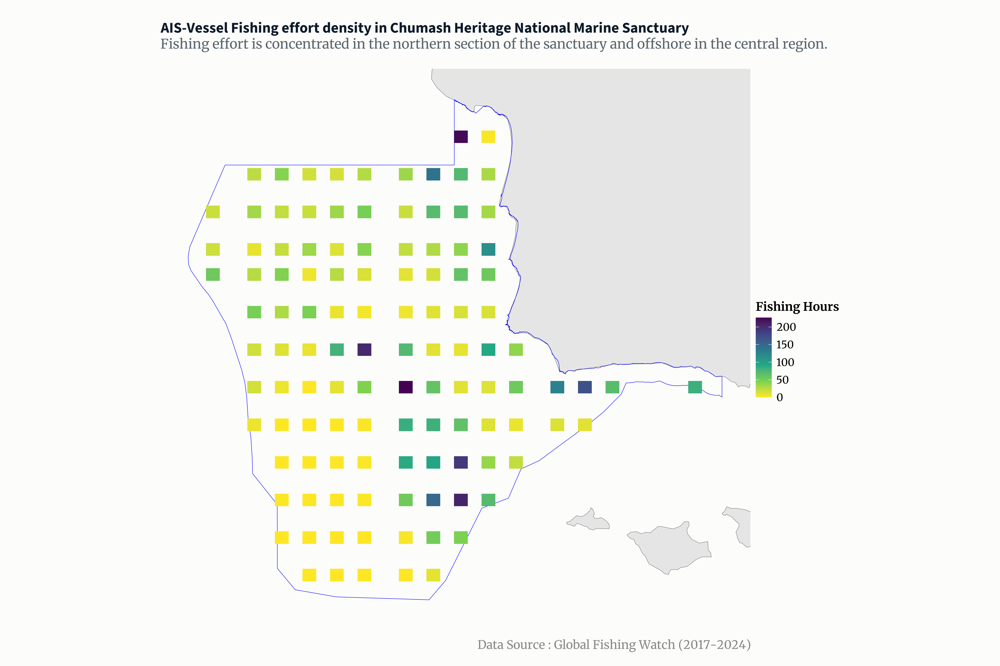
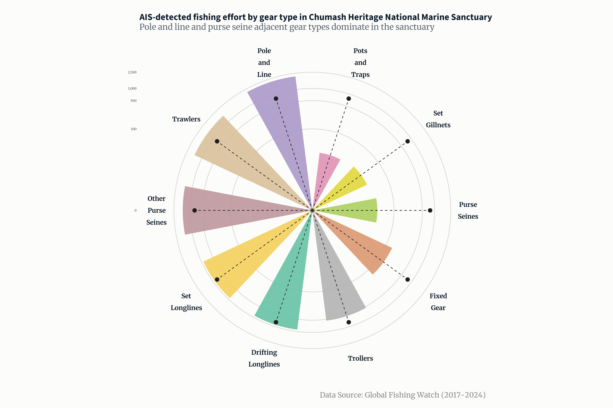

## Objective

### What does AIS-detected fishing activity look like in Chumash Heritage National Marine Sanctuary?

-   Seasonal patterns, gear use, and spatial hotspots derived from Global Fishing Watch AIS Data

### When (Seasonality) : Ridgeline Plot

#### How does the seasonal timing of AIS-detected fishing activity vary by gear type across months within Chumash Heritage National Marine Sanctuary?

Seasonal use of gear types by month to understand temporal patterns of use within the Sanctuary. This will inform readers about timing and seasonality, overlap or separation in gear use across months, and whether certain gears are seasonal or year-round.

### Where (Spatially) : Density Hotspot Map

#### Where are the spatial hotspots of AIS-detected fishing activity within Chumash Heritage National Marine Sanctuary?

In understanding where spatial hotspots of fishing activity are, this can inform readers where fishing concentrates spatially, whether activity is diffuse or clustered, and areas of potential overlap with sensitive habitats or biologically important areas.

### What (Magnitude): Bar Plot

#### How is overall AIS-detected fishing effort distributed among different gear types in Chumash Heritage National Marine Sanctuary?

By organizing the summed fishing effort hours by gear types, this will inform readers the relative dominance and composition of gear types, which gears contribute to overall AIS-detected fishing effort.

\*\* These questions have not changed since FPM #1\*\*

### Methods (Variables of Use)

I used a processed dataset of AIS-detected fishing activity from Global Fishing Watch covering vessels operation within Chumash Heritage National Marine Sanctuary from 2017-2024. After filtering fishing effort to the Sanctuary boundary using latitude and longitude coordinates, the dataset provides information on observation date (year, month), fishing gear type, vessel presence, and fishing effort (measured by fishing hours).

-   Seasonal patterns in gear use: I used variables month, year, gear type, and fishing hours*,* which will allow comparison of how AIS-detected fishing activity by gear type varies throughout the year.

-   Spatial hotspots of fishing activity: I used the latitude and longitude of Global Fishing Watch fishing effort grid cells in combination with fishing hours to visualize the density and concentration of fishing effort within the Sanctuary.

-   Overall fishing effort by gear type: I aggregated fishing hours by gear type across the full time period (2017-2024) to understand the magnitude and composition of fishing effort by gear type.

## Data Viz Inspo!

#### Ridgeline Plot

[](https://cran.r-project.org/web/packages/ggridges/vignettes/introduction.html)

<https://cran.r-project.org/web/packages/ggridges/vignettes/introduction.html>

This is a little different than how my ridgeplot will go, and I've thought about if I should change it but the ridgeplot is pretty good for showing seasonality although I've gone through examples and it's rare to see month on the x-axis and categorical variables (gear types) on the y-axis. So based on this figure and comparing it to mine, I am swapping the variables for:

-   x-axis: month (ordered categorical variable Jan-Dec. Gives temporal structure.

-   y axis: gear type (categorical), controls vertical placement of each ridge but does not have numeric meaning.

-   Ridge height (the peaks): relative density of fishing hours, which is where the hours will appear visually. The height would reflect how fishing hours are distributed across months within a gear type. The scale will be normalized.

#### Density Hotspot Map

[](https://elmeraa-usgs.github.io/posts/2021-03-07-cetacean-richness/cetacean-richness.html)

<https://elmeraa-usgs.github.io/posts/2021-03-07-cetacean-richness/cetacean-richness.html>

I was looking to add the the state outline along the hotspot density map, so I'm looking through the code to see where in the process Azadpour pulled in the shapefile of the stateoutline so the layers can go : state outline–\> sanctuary boundary outline –\> overlay of hotspot density of aggregated fishing hours. This way the sanctuary outline won't be floating in white space, I need something to ground it to.

#### Bar Plot

[](https://r-graph-gallery.com/web-circular-barplot-with-R-and-ggplot2.html)

<https://r-graph-gallery.com/web-circular-barplot-with-R-and-ggplot2.html>

-   Legend : incorporate as number of aggregated/ normalized fishing effort hours

-   I liked that each bar was a different categorical variable, which will be the same for the gear types

-   I liked being able to put in a mean effort hours line.

## Hand Drawing Anticipated Visualizations


## Recreating Hand Drawn Visualizations with Code

### Load and process data

```{r}
#| echo: false
#| eval: true
#| warning: false
#| message: false
#| fold: true

library(ggplot2)
library(sf)
library(readr)
library(dplyr)
library(forcats)
library(tidyverse)

#read in data file and shapefile boundary from "Data" 
fleet <-read.csv("data/fleet_chnms_2017_2024.csv")

# Load boundary again as sf
boundary <- st_read("data/chnms_designated_boundary/CHNMS_py.shp") %>%
  st_transform(4326)

# Load boundary again as sf
boundary <- st_read("data/chnms_designated_boundary/CHNMS_py.shp") %>%
  st_transform(4326)

# Convert fleet CSV back to sf for plotting
fleet_sf <- st_as_sf(fleet, coords = c("cell_ll_lon", "cell_ll_lat"), crs = 4326, remove = FALSE)

#need to aggregate by fishing hours by lat long
fleet_agg_fishing <- fleet %>%
  group_by(cell_ll_lat, cell_ll_lon) %>%
  summarise(total_hours = sum(fishing_hours, na.rm = TRUE))

#aggregrate by gear type with fishing hours
fleet_agg_gear <- fleet %>%
  group_by(geartype_label) %>%
  summarise(
    total_fishing_hours = sum(hours, na.rm = TRUE)
  )%>%
  filter(geartype_label != "Fishing") #removed fishing because it skewed data 
  
#aggregate gear type by season (ridgeline prep)
 fleet_agg_gear_month <- fleet %>%
  group_by(geartype_label) %>%
  mutate(total_gear_hours = sum(fishing_hours, na.rm = TRUE)) %>%
  ungroup() %>%
  mutate(
    geartype_label = fct_reorder(
      geartype_label,
      total_gear_hours,
      .desc = TRUE
    )
  )%>%
  filter(geartype_label != "Fishing")
 
```

#### Set Themes

```{r}
#| echo: false
#| fold: true
#| eval: true
#| warning: false
#| message: false

library(monochromeR)
library(showtext)
library(glue)
#......................import Google fonts.......................
# `name` is the name of the font as it appears in Google Fonts
# `family` is the user-specified id that you'll use to apply a font in your ggplot
font_add_google(name = "Source Sans 3", family = "sourcesans")
font_add_google(name = "Merriweather", family = "merriweather")
showtext_auto()

# font_add(family = "fa-brands", 
#          regular = here::here("fonts", "Font Awesome 7 Brands-Regular-400.otf")
# )

```

### Ridgeline Plot

```{r}
#| echo: false
#| eval: true
#| warning: false
#| message: false
#| fold: true

library(ggridges)
library(ggplot2)
library(viridis)

ais_ridgeline <-ggplot(fleet_agg_gear_month,
       aes(x = month,
           y = reorder(geartype_label, total_gear_hours, FUN = sum),
           fill = after_stat(x))) +
  geom_density_ridges_gradient(
    scale = 1.9,
  rel_min_height = 0.01,
  alpha = 1,      
  color = "#1a1a1a", 
  size = 0.4
  ) +
  scale_x_continuous(
    breaks = 1:12,
    labels = month.abb,
    expand = c(0.01, 0)
  ) +
  scale_fill_gradientn(
    colors = alpha(c("#3B5F8F", "#5A8CAE","#7FB8D4", "#FFD580", "#FFA040","#7FB8D4", "#A8D5E2","#5A8CAE"),
                   0.8),
    name = "Month", 
  ) +
  labs(
    title = "Seasonal fishing effort by gear type",
    subtitle = "Fishing peaks during fall months in Chumash Heritage National Marine Sanctuary,\nwith significant overlaps with Trawlers, Purse Seines, Set Gillnets,\nand Pots and Traps between September to November",
    x = NULL,
    y = NULL,
    caption = "Data: Global Fishing Watch AIS (2017-2024)"
  ) +
  theme_minimal() +
  theme(
    plot.background = element_rect(fill = "#FCFCFA", color = NA),
    panel.background = element_rect(fill = "#FCFCFA", color = NA),
    panel.grid = element_blank(),
    legend.position = "right",
    panel.spacing = unit(0.1, "lines"),
    text = element_text(family = "sourcesans"),
   plot.title = element_text(
  family = "sourcesans",
  size = 20,
  face = "bold",
  color = "#0D1B2A",
  hjust = 0,
  margin = margin(b = 3)
),
    plot.subtitle = element_text(
      family = "merriweather",
      size = 14,
      color = "#5A6670",
      hjust = 0,
      margin = margin(b = 18)
    ),
    plot.caption = element_text(
      family = "merriweather", 
      size = 10,
      color = "#888888",
      hjust = 1,
      margin = margin(t = 12)
    ),
    
    axis.text.y = element_text(
      color = "#0D1B2A",
      size = 14,
      face = "bold",
      hjust = 1,
      margin = margin(r = 10)
    ),
    axis.text.x = element_text(
      color = "#5A6670",
      size = 13,
      margin = margin(t = 5)
    ),
    plot.margin = margin(25, 25, 15, 25), 
    legend.title = element_text(
       family = "merriweather",
       face = "bold",
       size = 12
        ),
    legend.text = element_text(
    family = "merriweather",
     size = 10
      )
    )
ais_ridgeline

# ggsave(
#   filename = here::here("figures", "ais_ridgeline.png"),
#   plot = ais_ridgeline,
#   device = "png",
#   width = 15,
#   height = 10,
#   unit = "in",
#   dpi = 300
# )
```

**Alt-Text**: Ridgeline plot showing seasonal fishing effort by gear type in Chumash Heritage National Marine Sanctuary. Fishing activity peaks in fall, with strong overlaps among trawlers, purse seines, set gillnets, and pots and traps between September and November. The color gradient encodes seasonality, transitioning from dark blue in December to March, to lighter blue in April, shifting to yellow and orange during the summer months from June to August, and returning from lighter blue to darker blue in October through December.

In this ridgeline plot, the x-axis represents month, and the y-axis lists fishing gear types as categorical groups. Fishing hours are not plotted on a shared numeric y-axis; instead, they are encoded in the height and shape of each ridgeline as a smoothed distribution of AIS-detected fishing activity across months within each gear type. As a result, ridge height reflects relative seasonal intensity and the timing of peak activity rather than absolute fishing effort. This visualization is intended to highlight seasonal patterns and overlap in gear use, while total fishing effort by gear type is shown separately using an aggregated bar plot.

### Density Plot

Adding CA state outline to plot

```{r}
#| echo: false
#| eval: true
#| warning: false
#| message: false
#| fold: false

library(sf)
library(rnaturalearth)
library(rnaturalearthdata)

# High-resolution land polygons
land <- ne_download(
  scale = 10,
  type = "land",
  category = "physical",
  returnclass = "sf"
) %>%
  st_transform(4326)

# California bounding box for zoomed out plot 
ca_bbox <- st_as_sfc(st_bbox(c(xmin = -125, xmax = -114, ymin = 32, ymax = 42), crs = 4326))

# Clip to California
california <- st_intersection(land, ca_bbox)

chnms_bbox <- st_as_sfc(st_bbox(boundary)) %>% st_buffer(0.1) # add small buffer offshore

# Mask fleet to ocean only
fleet_ocean <- fleet_sf[!st_intersects(fleet_sf, california, sparse = FALSE), ]
fleet_ocean_df <- st_drop_geometry(fleet_ocean)
```

```{r}
#| echo: false
#| eval: true
#| warning: false
#| message: false
#| fold: true


ggplot() +
  geom_sf(data = california, fill = "gray90", color = "gray50") +
  geom_sf(data = boundary, fill = NA, color = "black")+
  geom_sf(data = fleet_ocean, fill = NA, color = "white") +
  stat_bin_2d(data = fleet, aes(x = cell_ll_lon, y = cell_ll_lat, weight = fishing_hours),
              bins = 20) +
  scale_fill_viridis_c(option = "viridis", direction = -1, name = "Fishing Hours") +
  theme_void()+
  theme(
    plot.background = element_rect(fill = "#FCFCFA", color = NA),
    panel.background = element_rect(fill = "#FCFCFA", color = NA),
    panel.grid = element_blank(),
    legend.position = "right",
    panel.spacing = unit(0.1, "lines"),
    text = element_text(family = "sourcesans"),
   plot.title = element_text(
  family = "sourcesans",
  size = 20,
  face = "bold",
  color = "#0D1B2A",
  hjust = 0,
  margin = margin(b = 3)
),
    plot.subtitle = element_text(
      family = "merriweather",
      size = 14,
      color = "#5A6670",
      hjust = 0,
      margin = margin(b = 18)
    ),
    plot.caption = element_text(
      family = "merriweather", 
      size = 10,
      color = "#888888",
      hjust = 1,
      margin = margin(t = 12)
    ),
    plot.margin = margin(25, 25, 15, 25), 
    legend.title = element_text(
       family = "merriweather",
       face = "bold",
       size = 12
        ),
    legend.text = element_text(
    family = "merriweather",
     size = 10
      ))+
  labs(title = "AIS-Vessel Fishing effort density in Chumash Heritage National Marine Sanctuary", 
       subtitle = "Fishing effort is concentrated in the northern section of the sanctuary and offshore in the central region.", 
       caption = "Data Source : Global Fishing Watch (2017-2024)")
```

```{r}
#| echo: false
#| eval: true
#| warning: false
#| message: false
#| fold: true
#zoomed in version of just sanctuary 

density_plot <- ggplot() +
  geom_sf(data = land, fill = "gray90", color = "gray50") +
  geom_sf(data = boundary, fill = NA, color = "blue", size = 1) +
  stat_bin_2d(data = fleet_ocean, aes(x = cell_ll_lon, y = cell_ll_lat, weight = fishing_hours),
              bins = 35) +
  scale_fill_viridis_c(option = "viridis", direction = -1, name = "Fishing Hours") +
  labs(title = "AIS-Vessel Fishing effort density in Chumash Heritage National Marine Sanctuary", 
       subtitle = "Fishing effort is concentrated in the northern section of the sanctuary and offshore in the central region.", 
       caption = "Data Source : Global Fishing Watch (2017-2024)")+
  theme_void() +
  theme(
    plot.background = element_rect(fill = "#FCFCFA", color = NA),
    panel.background = element_rect(fill = "#FCFCFA", color = NA),
    panel.grid = element_blank(),
    legend.position = "right",
    panel.spacing = unit(0.1, "lines"),
    text = element_text(family = "sourcesans"),
   plot.title = element_text(
  family = "sourcesans",
  size = 50,
  face = "bold",
  color = "#0D1B2A",
  hjust = 0,
  margin = margin(b = 3)
),
    plot.subtitle = element_text(
      family = "merriweather",
      size = 45,
      color = "#5A6670",
      hjust = 0,
      margin = margin(b = 18)
    ),
    plot.caption = element_text(
      family = "merriweather", 
      size = 40,
      color = "#888888",
      hjust = 1,
      margin = margin(t = 12)
    ),
    plot.margin = margin(25, 25, 15, 25), 
    legend.title = element_text(
       family = "merriweather",
       face = "bold",
       size = 40
        ),
    legend.text = element_text(
    family = "merriweather",
     size = 35
      ))+
  coord_sf(xlim = st_bbox(chnms_bbox)[c("xmin", "xmax")],
           ylim = st_bbox(chnms_bbox)[c("ymin", "ymax")])

# ggsave(
#   filename = here::here("figures", "ais_density.png"),
#   plot = density_plot,
#   device = "png",
#   width = 15,
#   height = 10,
#   unit = "in",
#   dpi = 300
# )
```



**Alt-text**: AIS-based fishing effort in the Chumash Heritage National Marine Sanctuary. Fishing effort is concentrated in the northern section of the sanctuary and offshore in the central region, near known seafloor features such as seamounts. Data are binned into 35 cells, with the summed apparent fishing hours represented on a viridis gradient: higher effort areas are shown in purple, and lower effort areas in yellow.

### Circle Bar Plot

```{r}
#| echo: false
#| eval: true
#| warning: false
#| message: false
#| fold: true

library(ggplot2)
library(dplyr)
library(scales)
library(stringr)


mean_hours <- mean(fleet_agg_gear$total_fishing_hours)

circle_plot <- ggplot(fleet_agg_gear) +
  # Custom circular grid lines
  geom_hline(
    aes(yintercept = y),
    data.frame(y = c(0, 100, 500, 1000, 2500)),  # adjust to range
    color = "lightgrey"
  ) +
  
  # Bars colored by gear type
  geom_col(
    aes(
      x = reorder(str_wrap(geartype_label, 5), total_fishing_hours),
      y = total_fishing_hours,
      fill = geartype_label
    ),
    position = "dodge2",
    show.legend = TRUE,
    alpha = 0.9,
    width = 0.6
  ) +
  
  # Mean effort hours dot
  geom_point(
    aes(
      x = reorder(str_wrap(geartype_label, 5), total_fishing_hours),
      y = mean_hours
    ),
    size = 3,
    color = "gray12"
  ) +
  
  # Lollipop shaft to mean line
  geom_segment(
    aes(
      x = reorder(str_wrap(geartype_label, 5), total_fishing_hours),
      y = 0,
      xend = reorder(str_wrap(geartype_label, 5), total_fishing_hours),
      yend = mean_hours
    ),
    linetype = "dashed",
    color = "gray12"
  ) +
  
  # Make it circular
  coord_polar() +
  scale_fill_manual(values = colorRampPalette(RColorBrewer::brewer.pal(8, "Set2"))(10), 
                  name = "Gear Type")+
  scale_y_continuous(
     trans = "log1p",#log to see other lower gear types clearly
    labels = comma,
     breaks = c(0, 100, 500, 1000, 2500),
    name = "Total Fishing Hours"
  ) +
  
  labs(
    title = "AIS-detected fishing effort by gear type in Chumash Heritage National Marine Sanctuary",
    subtitle = "Pole and line and purse seine adjacent gear types dominate in the sanctuary",
    caption = "Data Source: Global Fishing Watch (2017-2024)",
    x = NULL,
    fill = "Gear Type"
  ) +
  theme_minimal() +
  theme(
  axis.title = element_blank(),
  axis.ticks = element_blank(),
  panel.grid = element_blank(),
  plot.background = element_rect(fill = "#FCFCFA", color = NA),
  panel.background = element_rect(fill = "#FCFCFA", color = NA),
  legend.position = "none",
  panel.spacing = unit(0.1, "lines"),
  text = element_text(family = "sourcesans"),
  
  plot.title = element_text(
    size = 50, 
    face = "bold",
    color = "#0D1B2A",
    hjust = 0,
    margin = margin(b = 3)
  ),
  plot.subtitle = element_text(
    family = "merriweather",
    size = 45,
    color = "#5A6670",
    hjust = 0,
    margin = margin(b = 10)
  ),
  plot.caption = element_text(
    family = "merriweather", 
    size = 40,
    color = "#888888",
    hjust = 1,
    margin = margin(t = 8)
  ),
  plot.margin = margin(25, 25, 15, 25), 
  legend.title = element_text(
    family = "merriweather",
    face = "bold",
    size = 40
  ),
  legend.text = element_text(
    family = "merriweather",
    size = 35
  ), 
  axis.text.x = element_text(
    family = "merriweather",
    size = 35,      
    color = "#0D1B2A",
    lineheight = 0.5,
    face = "bold"
  ),
  axis.text.y = element_text(
  family = "merriweather",
  size = 18,
  color = "gray30")
)

# ggsave(
#   filename = here::here("figures", "ais_circle.png"),
#   plot = circle_plot,
#   device = "png",
#   width = 15,
#   height = 10,
#   unit = "in",
#   dpi = 300
# )
```



**Alt-text** : Fishing effort by gear type in Chumash Heritage National Marine Sanctuary, shown as a circular bar plot. Pole and line and purse seine–related gear types dominate the sanctuary, while set gillnets and pots and traps contribute relatively low effort. The mean fishing hours across all gear types is indicated by a gray dot at 776.87 hours. Bars have distinct colors for each gear type.

### Questions

1.  What are the key insights you want your infographic to communicate, and how will your design choices help highlight and support those messages?
    -   Ridgeline plot - seasonal fishing gear by type: I want to highlight that fishing activity in the sanctuary is highly seasonal, with clear peaks during fall months (September-November) and lower effort in winter and spring. Certain gear types dominate at different times of the year. The design insights are that the stacked ridgeline uses a seasonal color gradient to visually show time progression throughout the year. The transparency and height of ridgelines still highlights overlapping gear activity while still showing relative magnitude.
    -   Density plot- spatial concentration of fishing effort: I want to show that fishing is concentrated in certain parts of the sanctuary boundaries. This highlights where monitoring or management insight can be taken into consideration. For designed I used a binned density with a viridis color gradient to show areas of high versus low fishing hours. Buffering the sanctuary boundaries slightly prevents overlap with the land making offshore patterns clear.
    -   Circular bar plot- total fishing hours by gear type: I want to highlight that there are certain gears that dominate the sanctuary's AIS fishing effort, and some are minimal. The mean fishing hours across gear types provides a reference for comparison. For design, the circular layout draws attentions to the differences in hours between gear types. Adding distinct colors makes the categorical variables easy to distinguish.
2.  What challenges did you encounter or anticipate encountering as you continue to build / iterate on your visualizations in R? If you struggled with mocking up any of your three visualizations, describe those challenges here.
    -   Ridgeline plot: I had trouble incorporating the seasonal legend directly in R. The plot shows peaks by gear type and month, the color gradient for seasons (December–March, April–August, September–November) is not reflected in the legend. I plan to finalize this legend in Affinity.

    -   Density plot: The binned 2D histogram looks blocky, and I would like to smooth the density representation to highlight gradients of fishing effort. I have a high-resolution coastline for California, the overall state outline becomes merged with the land polygon, so I need to work on getting a distinct boundary of the state to provide better geographic context.

    -   Circular plot: Adding numeric hour breaks along the radial lines of the circle plot was challenging. The y-axis labels do not naturally follow the curvature of the circle, making it difficult to communicate scale. So I will also finish that up in Affinity.
3.  What ggplot extension tools / packages do you need to use to build your visualizations? Are there any that we haven’t covered in class that you’ll be learning how to use for your visualizations?
    -   **ggridges** for the ridgeline plot to show seasonal fishing effort across gear types.

        **scales** to format y-axis labels and create log transformations for better visual clarity.

        **RColorBrewer and viridis** for color palettes.

        **ggtext** to use custom fonts for titles, subtitles, captions, and legends.

        **sf and rnaturalearth** to handle spatial data and plot the density and boundary maps.

        **dplyr, forcats, and stringr** for data wrangling, reordering factor levels, and wrapping text labels.

    -    I think we have gone over all of these in class except **forcats** I don't anticipate bringing in other packages.
4.  What feedback do you need from the instructional team and / or your peers to ensure that your intended message and key insights are clear?
    -   I’d like feedback on whether the main messages of my three plots: seasonal trends in fishing (ridgeline), where fishing is concentrated offshore (density map), and total effort by gear type (circle plot) come across clearly.
        -   Ridgeline: Does the seasonal legend make it easy to see patterns across months? Are the gear types easy to tell apart?
        -   Density: Can people quickly see where the most fishing is happening offshore? Does the color scale make sense?
        -   Circle plot: Are the gear type labels around the circle readable? Do the mean dots help highlight overall effort? I log scaled the y-axis to show relative magnitude, should I keep it?
        -   Any thoughts on font size, label placement, or whether the plots make sense on their own would be really helpful.
